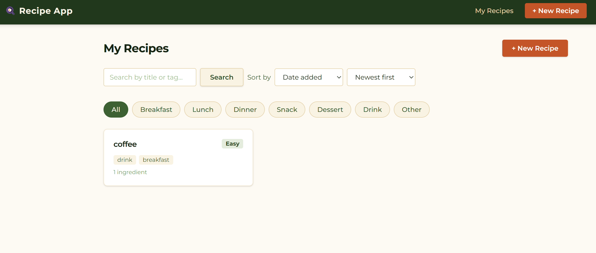

# Recipe App

A full-stack recipe management application with user authentication.



## Stack

- **Backend**: Node.js / Express / MongoDB (Mongoose)
- **Frontend**: React 18 / Vite 6 / React Router v6
- **Auth**: JWT access tokens (5 min, in-memory) + refresh tokens (1 day, httpOnly cookie)

## Features

- User registration and login
- Create, view, edit, and delete recipes
- Recipes include title, description, ingredients, instructions, prep/cook time, servings, category, and tags
- Search recipes by keyword
- Filter recipes by category
- Sort recipes by title, date, prep time, or cook time
- Protected routes — only authenticated users can manage recipes

## Project Structure

```
recipe-app/
├── backend/
│   ├── config/         # MongoDB connection
│   ├── controllers/    # Route handlers (auth, recipes)
│   ├── middleware/     # JWT auth, input validation
│   ├── models/         # Mongoose schemas (User, Recipe)
│   ├── routes/         # Express routers
│   └── server.js       # App entry point
├── frontend/
│   └── src/
│       ├── api/        # Axios instances and API helpers
│       ├── components/ # Reusable UI components
│       ├── context/    # AuthContext (session management)
│       ├── hooks/      # useAuth
│       └── pages/      # Route-level page components
└── design/             # System design and feature specs
```

## Getting Started

### Prerequisites

- Node.js 18+
- MongoDB (local or Atlas)

### Backend

```bash
cd backend
npm install
```

Create a `backend/.env` file:

```
PORT=5000
MONGO_URI=mongodb://localhost:27017/recipe-app
JWT_SECRET=your_jwt_secret
REFRESH_TOKEN_SECRET=your_refresh_secret
CLIENT_URL=http://localhost:3000
```

```bash
npm run dev
```

### Frontend

```bash
cd frontend
npm install
npm run dev
```

The frontend runs on `http://localhost:3000` and the backend on `http://localhost:5000`.

## Testing

```bash
cd backend
npm test
```

Tests cover auth controller, recipe controller, sorting logic, auth middleware, and validation middleware.
